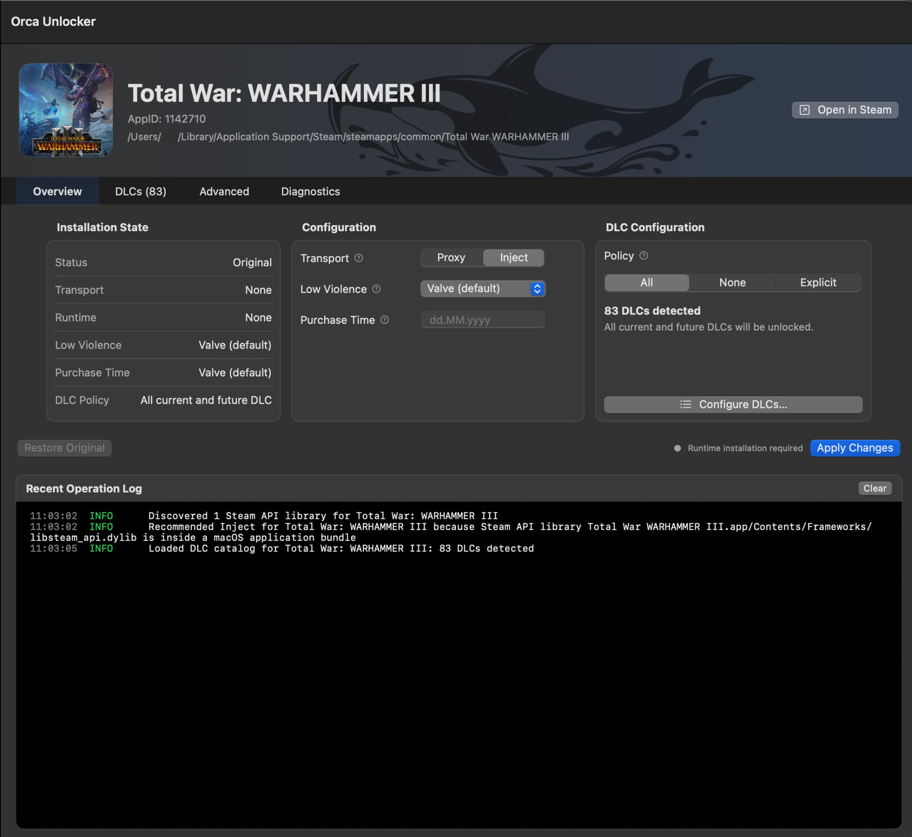
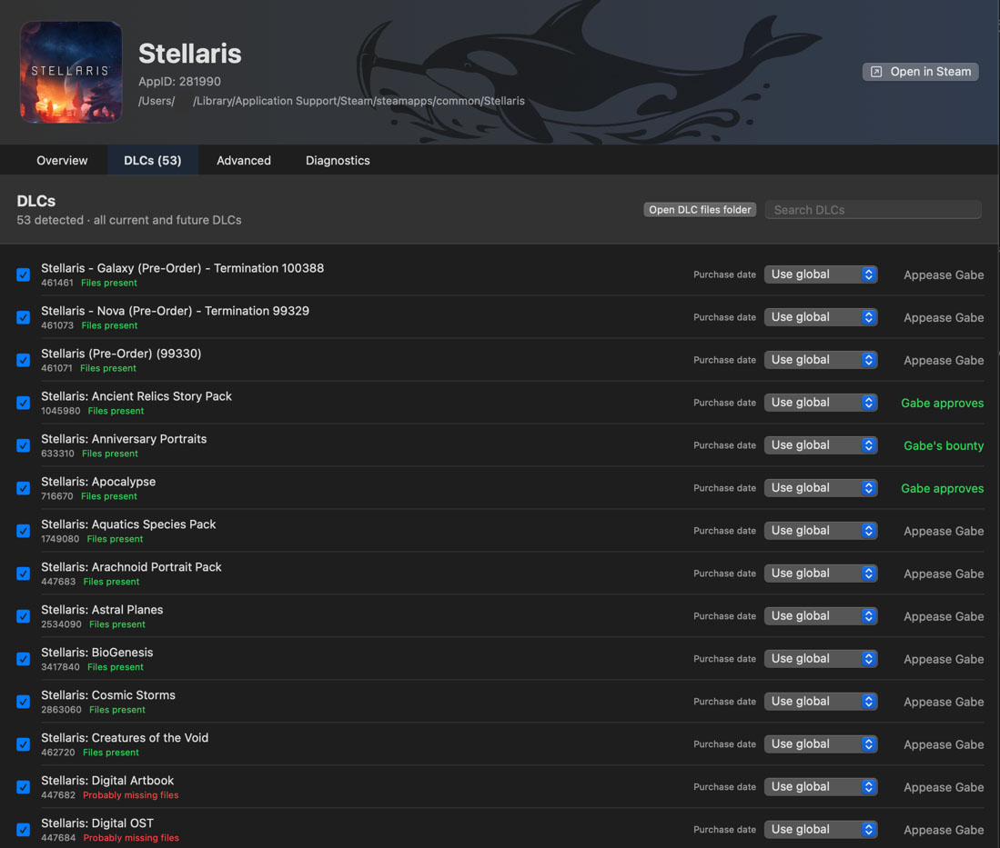
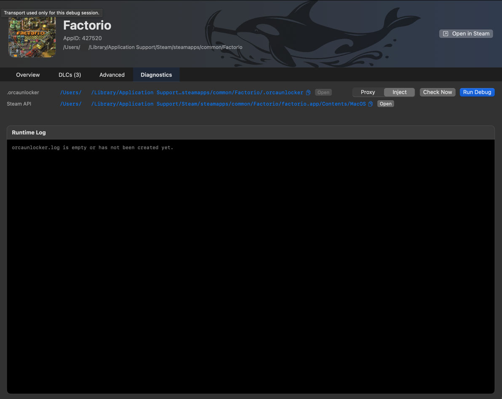

### Overview



The **Overview** tab contains the main configuration and installation controls.

#### Transport

- **Proxy** — installs the runtime into the game's application bundle.
- **Inject** — loads the runtime using the injection method without replacing the game's Steam API library.

You can switch between **Proxy** and **Inject** at any time and press **Apply Changes** to reinstall the runtime using the selected method.

The launcher may recommend a transport automatically based on the detected Steam API layout.

> The **Proxy** method requires macOS **App Management** permission because it modifies files inside the game's `.app` bundle.

#### DLC Configuration

- **All** — enable all currently detected DLCs and automatically include future DLCs.
- **None** — do not enable any DLCs.
- **Explicit** — select DLCs individually.

Use **Configure DLCs...** to manage individual DLCs.

#### Other options 

Mostly useless for you. Can be skipped.

- **Low Violence** — controls the Steam low-violence flag.
- **Purchase Time** — overrides the reported purchase time.

## DLCs



The **DLCs** tab shows all DLCs detected for the selected game.

At the top of the page you can see how many DLCs were detected and which DLC policy is currently active.

Each DLC entry shows:

- DLC name
- DLC ID
- Whether the corresponding files appear to be present on disk
- Purchase date configuration
- Current DLC status

### File status

Orca Unlocker checks the game installation for files associated with each DLC.

A DLC may be shown as:

- **Files present** — the expected DLC files were found.
- **Probably missing files** — the DLC is known to Orca Unlocker, but its files do not appear to be installed.
- **Files unknown** — well, basically exactly what the name says: Orca Unlocker has no idea what's going on with these files.

`Probably missing files` is not exactly `Missing files`: file layouts differ between games and not every DLC can be detected perfectly.

Use **Open DLC files folder** if you want to inspect the relevant game files manually. But again, Orca Unlocker does not always detect the folder perfectly.

Orca Unlocker currently does **not** download missing DLC files automatically.


### DLC status

The right side of each DLC entry shows its Steam ownership status:

- **Appease Gabe** — you do not own this DLC. Click it if you want to buy it.
- **Gabe approves** — you already own this DLC.
- **Gabe's bounty** — Gabe gave you this DLC for free. Praise his generosity!

### Enabling DLCs

The checkbox on the left controls whether a DLC is enabled when using an explicit DLC configuration.

The global DLC policy can be changed from the **Overview** tab:

- **All** — enable all current and future DLCs.
- **None** — disable all DLCs.
- **Explicit** — select individual DLCs.

### Purchase date

Each DLC has its own **Purchase date** setting.

By default it is set to:

```text
Use global
```
which means the DLC uses the purchase date configured on the **Overview** page.

## Diagnostics



The **Diagnostics** tab is mostly here for when something does not work and I need to figure out why. Really hope you'll never need this page.

At the top you can see the paths Orca Unlocker detected for:

- **.orcaunlocker** — the game's Orca Unlocker configuration and runtime data directory.
- **Steam API** — the Steam API library or location detected for the selected game.

The blue paths can be copied, and **Open** opens the corresponding location in Finder.

### Check Now

Click **Check Now** to refresh the current diagnostic state without starting a debug session.

### Run Debug

If the game does not work correctly, this is the useful part.

1. Select **Proxy** or **Inject**.
2. Click **Run Debug**.
3. Wait for the game to load.
4. Close the game and return to **Diagnostics**.
5. Check the **Runtime Log**.

The selected **Proxy / Inject** transport is used only for this debug session. It does not change the transport configured for normal use.

If you want to submit a bug report, please run diagnostics with both methods and attach both reports to the GitHub issue!

Debug mode uses the verbose runtime build and writes additional diagnostic information, so you probably do not want to use it all the time - it can slow down the game.

### Sending a debug report

If you want to report a problem:

1. Open **Diagnostics**.
2. Select **Proxy**.
3. Click **Run Debug**.
4. Wait for the game to load. If possible, open something in the game that should contain or use DLC content.
5. Quit the game.
6. Get the report ZIP using the **Open** button in the Diagnostics UI.
7. Repeat the same steps using **Inject**.
8. Attach both reports to the GitHub issue.
